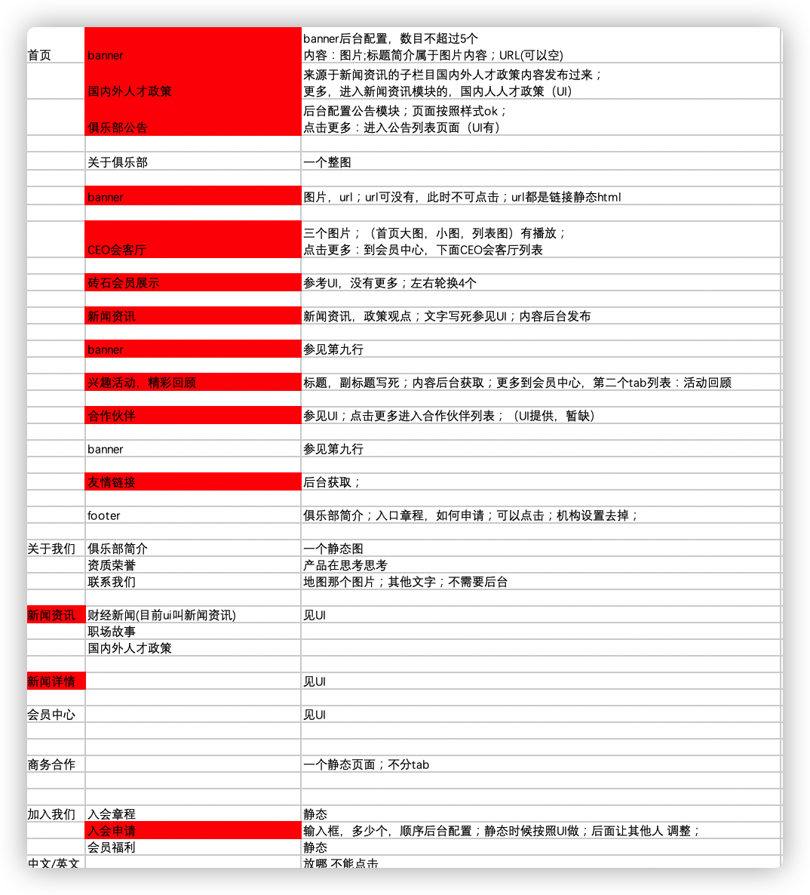

# mctc-api-doc
## 官网前后端交互概述

### 前置条件
官网顶部的菜单前端写死，但是每个菜单项要与后端定义code，
因为每个菜单下的动态内容就是根据菜单code获取；静态的页面和页面里的静态板块由前端处理。

### 交互流程
初次进入系统默认到首页，前端先根据首页的code调用后端接口获取动态内容，加上静态内容渲染出页面
后续用户切换菜单也按此流程处理。获取动态内容流程：1.根据菜单获取板块列表；2.根据板块获取其内容；这个官网只有入会申请这一个上行功能，需要先根据动态表单配置做页面

### 接口概要
1. 根据菜单code获取页面板块

    数据是一个json，包含了一个界面的所有板块（一个板块或多个），根据顺序+静态内容组合成页面
    
        `
        {
            菜单名称:"首页",
            菜单code:"homepage",
            页面板块:
            [
                {
                    "板块名称":"多图banner",
                    "排序":"1",
                    "板块展示样式":"",
                    "内容类型":"",
                    "板块code":"",
                    "板块id":"",
                    ...
                },
                {},
                {}
            ]
        }
        `
1. 根据菜单id和板块id获取板块内容，当内容为榜单时支持分页'

    数据是一个json，包含了一个板块的内容：
    
        `
        {
            "板块名称":"多图banner",
            "排序":"1",
            "板块展示样式":"",
            "内容类型":"",
            "板块code":"",
            "板块id":"",
            "板块内容":object,
            ...
        }
        `
    
    各页面板块内容，如下图（红色为动态内容）
    
    
    
    - 板块展示样式:
        - 0-多图banner
        - 1-单图banner
        - 2-首页两列文字榜单，如：国内外人才政策，公告
        - 3-首页CEO会客厅
        - 4-首页钻石会员展示
        - 5-首页新闻
        - 6-首页活动
        - 7-合作伙伴
        - 8-友情链接
        - 9-文章列表，如：新闻咨询下的人才政策，会员中心下的兴趣活动
        - 11-动态表单， 如：入会申请
    - 内容类型:
        - 0-banner
        - 1-自动榜单
    - 数据, 比如banner的内容  榜单 这里是object 会是数组以及嵌套对象
    - 排序, 此板块在页面里的位置
    - ps: 入会申请的表单是根据配置定制的，所以动态表单返回的内容会告诉前端怎么渲染表单
1. 提交入会申请